# NEDP — Active Ageing Index Platform

**A national elderly-screening data platform for Thailand's NEDP programme** ("โครงการมุ่งเป้าสูงวัย"), built on **Next.js 15** (App Router) + **Supabase**, with a **LINE Official Account** as the front door for field staff.

> Extracted from a production system serving real screening projects. This repo ships the full app — routes, scoring logic, LINE integration, exports — with sample/demo data. No real personal data, and no secrets, are included; see [Security notes](#security-notes).

**🔗 Live demo:** [nedp-showcase.vercel.app](https://nedp-showcase.vercel.app) · [/manual guide](https://nedp-showcase.vercel.app/manual) — a separate deployment of this repo, running on its own built-in mock data with no real backend behind it.

Projects across Thailand each run their own elderly-screening questionnaire (fall risk, bone density, nutrition, or a fully custom survey). NEDP standardizes the output into one comparable score — the **Active Ageing Index (AAI)** and its 4 domains — while letting every project keep its own instrument and its own dashboard.

---

## Screenshots

### 👤 User side — field-staff app (opened inside LINE)

| | | |
|---|---|---|
| 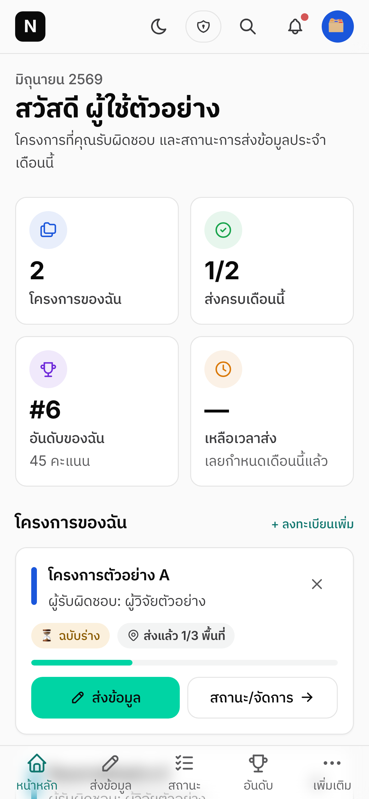 | 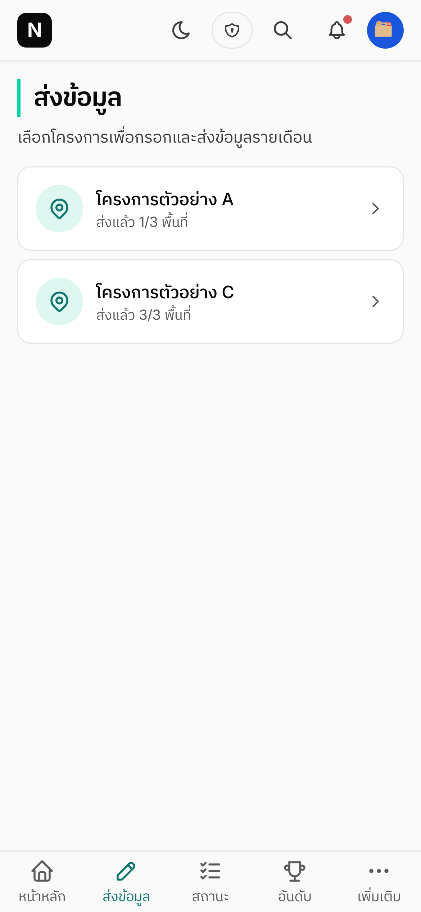 | 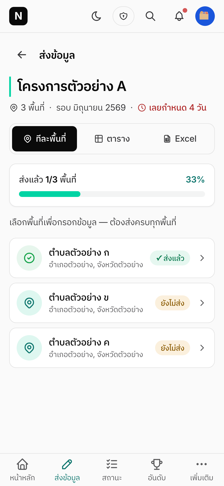 |
|:--:|:--:|:--:|
| Dashboard | Submit — pick a method | Submit — pick a location |
| 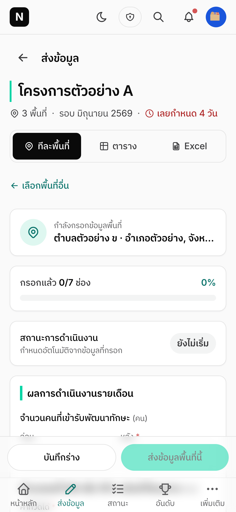 | 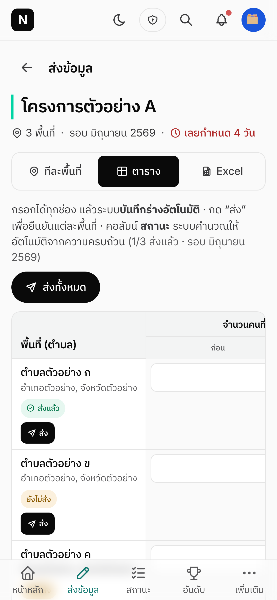 | 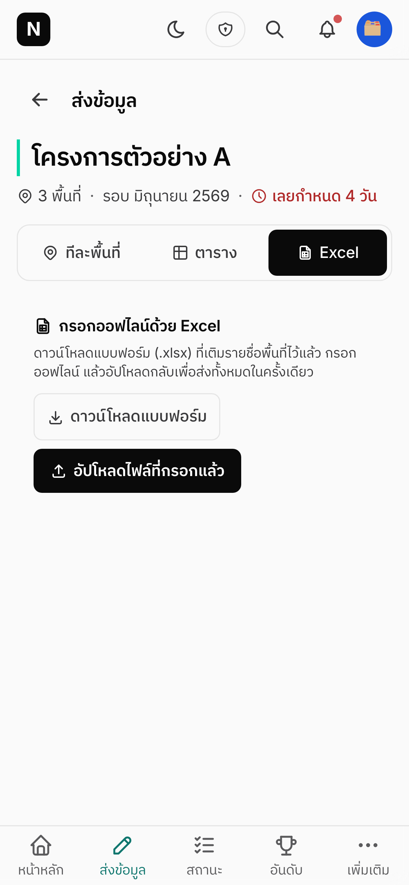 |
| Submit — form entry | Submit — grid entry | Submit — Excel upload |
| 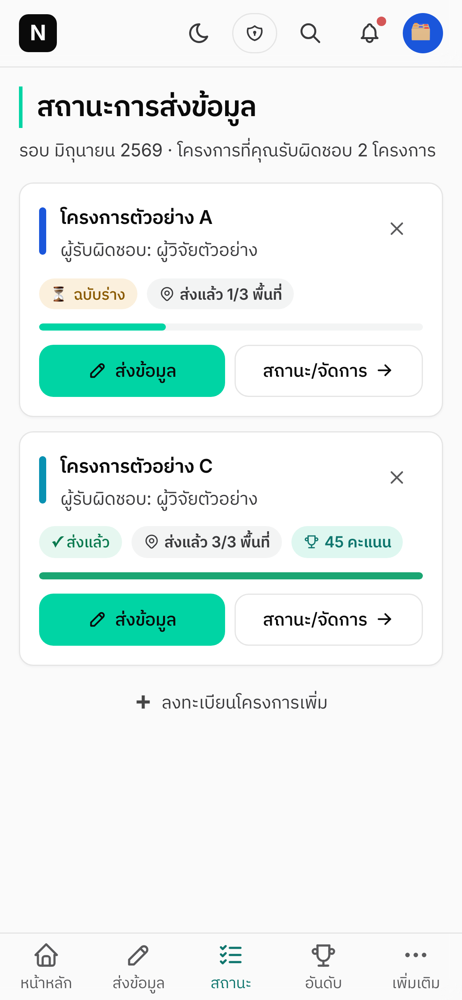 | 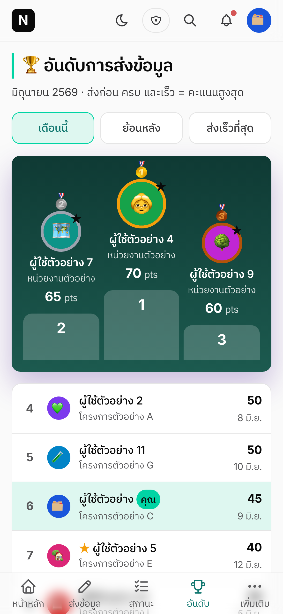 | 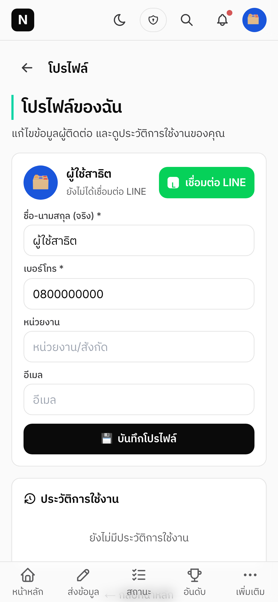 |
| Status tracking | Leaderboard | Profile |

### 🛠 Admin side — central monitor

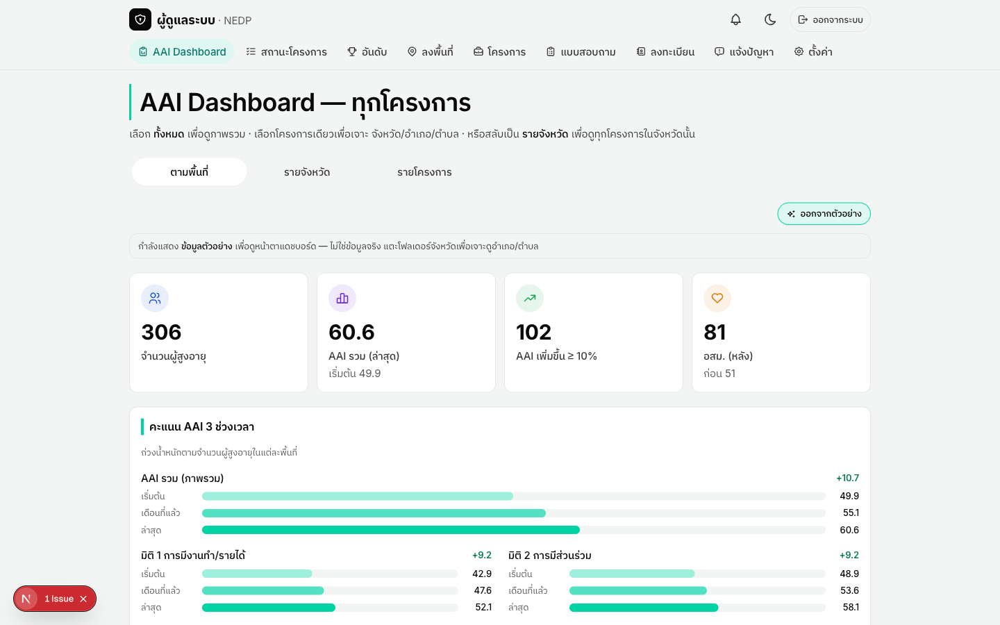

*AAI Dashboard, sample data*

### 💬 LINE Official Account

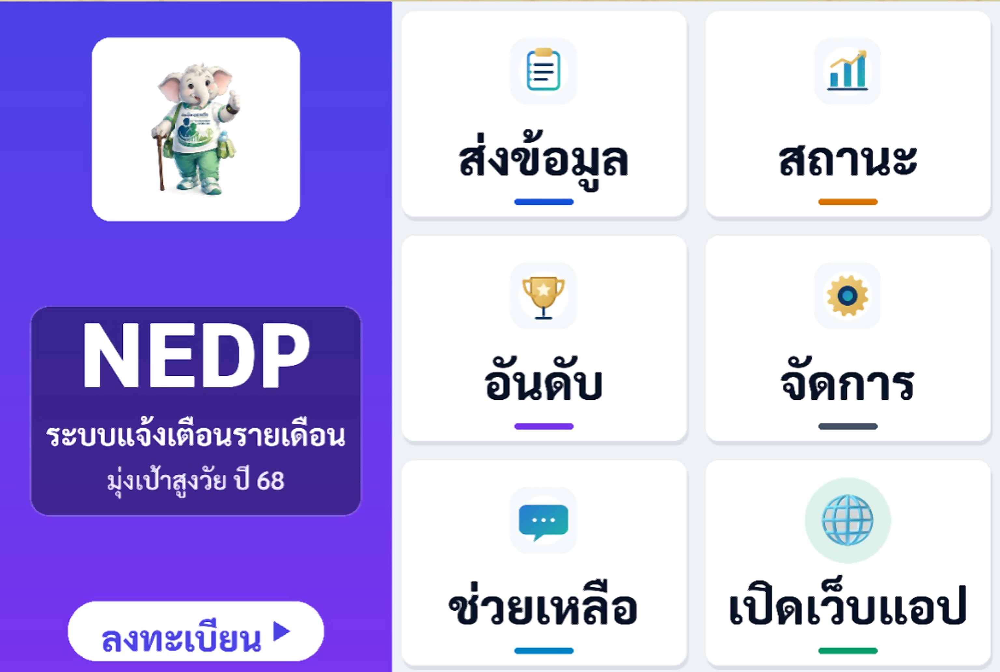

*LIFF login*

For the LINE plumbing on its own (LIFF, signed webhooks, push/Flex, reminders, RSVP — no `@line/bot-sdk`), see **[line-oa-nextjs-starter](https://github.com/jjnnaappaatt/line-oa-nextjs-starter)**, a self-contained teaching repo this one shares its LINE fundamentals with.

---

## What it demonstrates

| Feature | Where |
|---|---|
| **Two-layer AAI**: an Overall AAI + 4 domains computed from a hidden internal indicator set (never displayed), shown *per project*, alongside each project's own **custom questionnaire dashboard** | `components/admin/AdminAaiDashboard.tsx`, `components/portal/SurveyDashboard.tsx`, `lib/data/sb/dashboard.ts`, `lib/data/sb/questionnaire.ts` |
| **Postgres-side scoring**: indicators → domains → Overall AAI computed by a DB trigger, not application code | `supabase/migrations/` (`fn_score_person_assessment` → `aai_derive_indicators` → `aai_score_indicators`) |
| **k-anonymity-aware rollups**: any cell (project, tool, or location) under a person-count threshold is suppressed before it ever reaches the client | `lib/data/sb/aai.ts`, `lib/data/sb/questionnaire.ts` |
| **LINE Login (LIFF)** session bridging a LINE identity to an app account | `components/line/LiffProvider.tsx`, `lib/line/liff.ts` |
| **Signed inbound webhook** (`X-Line-Signature` HMAC verify + command-bot dispatch) | `app/api/webhooks/line/route.ts` + `lib/line/push.ts` (verify), `lib/line/webhook.ts` (dispatch) |
| **Outbound push + Flex messages**, scheduled reminders (advance → due → overdue), and RSVP invites | `lib/line/push.ts`, `lib/line/reminders.ts` |
| **Per-project data intake**: structured form, spreadsheet-style grid, and Excel-template upload, all validating against the same schema | `components/submit/`, `app/api/template/` |
| **Role-gated exports**: project users export their own full data; admins export project-progress + AAI summaries only (never raw per-person data across projects) | `app/api/export/`, `lib/server/xlsx.ts` |
| **Custom per-project questionnaires** feeding 24 ported clinical scoring tools (FRAIL, Barthel, MNA-SF, FRAX, …) alongside free-form survey questions | `lib/questionnaire/`, `components/questionnaire/` |

## Architecture at a glance

```
                    ┌───────────────── LINE Platform ─────────────────┐
                    │  Messaging API   ·   LINE Login   ·   LIFF       │
                    └───────┬───────────────┬──────────────────┬──────┘
             push / reply   │      webhook  │        login /   │
             (Bearer token) │  (X-Signature)│    access token  │
                    ┌───────▼───────────────▼──────────────────▼──────┐
                    │              Next.js app (this repo)             │
                    │                                                  │
                    │  app/(user routes)     submit, status, portal,   │
                    │                         leaderboard, profile     │
                    │  app/admin/*            central monitor, exports │
                    │  app/api/webhooks/*     inbound LINE events → bot│
                    │  app/api/line/*         login / subscribe        │
                    │  app/api/cron/*         scheduled reminders      │
                    │  lib/line/*             LINE plumbing (fetch,    │
                    │                         no @line/bot-sdk)        │
                    │  lib/data/sb/*          Supabase data layer      │
                    └───────────────────────┬──────────────────────────┘
                                            │
                                   ┌────────▼────────┐
                                   │    Supabase     │  Postgres — scoring
                                   │   (Postgres)    │  trigger + RLS +
                                   └─────────────────┘  pg_cron reminders
```

## Tech stack

Next.js 15 (App Router) · React 19 · TypeScript · Tailwind CSS · Supabase (Postgres + RLS) · `@line/liff` · GSAP · Three.js (`@react-three/fiber`) · `exceljs` / `docx` / `pdfkit` for exports.

## Quickstart

**1. Install**

```bash
git clone https://github.com/jjnnaappaatt/NEDP.git
cd NEDP
npm install
```

**2. Run — mock-first, zero backend required**

```bash
npm run dev   # http://localhost:3000
```

The app ships with a built-in mock dataset (`lib/mock/`) — ten sample projects, sample accounts, sample submissions — and defaults to `NEXT_PUBLIC_DATA_SOURCE=mock`. You can explore every screen above with no Supabase project and no LINE channel.

**3. (Optional) Wire up Supabase + LINE for the real backend**

```bash
cp .env.example .env.local     # fill in as you go
```

- Create a Supabase project, run the migrations in `supabase/migrations/` in order, then set `NEXT_PUBLIC_DATA_SOURCE=supabase` plus the Supabase env vars. Note: `supabase/schema.sql` is a Phase-2 baseline snapshot and isn't kept fully current with every dated migration (see `supabase/migrations/README.md`) — treat the dated migrations as the source of truth and expect to reconcile a few gaps by hand.
- Create a LINE Login channel (for LIFF) and a LINE Messaging API channel (for push/webhook/rich menu), then fill in the `LINE_*` vars.

**4. Typecheck / build**

```bash
npm run typecheck
npm run build
```

## Project structure

```
app/                  Next.js routes — user pages, admin/*, api/*
components/           admin/ dashboard/ forms/ line/ portal/ questionnaire/ submit/ ui/ ...
lib/
  aai/                Indicator → domain → Overall AAI math (mirrors the DB trigger)
  data/               Data-access layer; data/sb/* = Supabase adapters
  line/               LIFF, webhook, push, Flex messages, reminders — plain fetch, no bot SDK
  questionnaire/      Ported clinical scoring tools + survey schema
  mock/               Built-in demo dataset (default data source)
supabase/
  schema.sql          Base schema
  migrations/         Dated migrations (run in order)
  security/           RLS negative tests, pilot-readiness checks
docs/screenshots/     Screenshots used in this README
```

## Security notes

- **No secrets are committed.** `.env.local` is gitignored; only `.env.example` (placeholder values) is tracked. See `.gitignore`.
- **No real personal data is included.** The AAI trigger and RLS policies enforce k-anonymity-aware rollups in the live system; this repo's sample data (`lib/mock/`) uses fictional Thai names for demonstration only.
- If you deploy this yourself, generate fresh values for `ADMIN_SESSION_SECRET`, `CRON_SECRET`, and your Supabase/LINE credentials — never reuse anything from this repo's history.

## License

[MIT](LICENSE)
